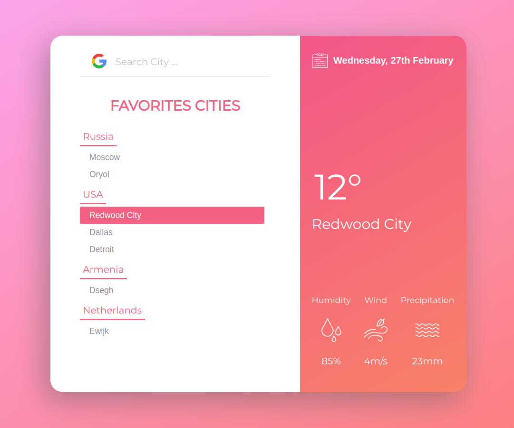

## Weather forecast React App

[](https://travis-ci.com/haritonasty/forecast)
[](https://coveralls.io/github/haritonasty/forecast?branch=develop)

## Задание 
#### Создать одностраничное приложение на React & Redux на основе react-boilerplate

- В приложении есть верхняя, левая и правая панель. 
- Приложение имеет предустановленный список стран и городов в виде дерева в левой панели. 
- Если открыть страну, раскрывается список городов. 
- Если кликнуть по названию города, в правой панели откроется информация о погоде на определенную дату. 
- Погода загружается из бесплатного сервиса погоды, используя API запрос (запрос погоды по выбранному городу и дате). 
- Список городов ограничен и предустановлен вами в json структуре. 
- В верхней панели есть возможность установить эту дату при помощи стороннего датапикера. 
- По умолчанию выводится сегодняшняя дата.
- Каждый action должен отображаться (логгироваться) в консоли браузера. 

##### Внешний вид приложения в данном задании оцениваться не будет — сконцентрируетесь на реализации функционала.

#### [Смотреть демо без локальной установки](https://forecast-csssr.firebaseapp.com/)

### Запуск
```
npm install
npm run start
```
Приложение запустится на [http://localhost:3000](http://localhost:3000)




### Функциональность
- Приложение отображает температуру, относительную влажность воздуха, скорость ветра и количество осадков для выбранного города на конкретную дату.
- Используется поиск городов (Google Places API) -> город добавится в список избранных ниже.
- Можно выбрать дату только из предыдущих 30 дней ([Weatherbit API](https://www.weatherbit.io/) free plan)

### Технические детали

- Приложение построено на основе шаблона [react-boilerplate](https://github.com/react-boilerplate/react-boilerplate)
- `styled components`
- `redux-saga`
- `reselect`
- `immutableJS`
- `npm run generate` для генерации компонентов
- Предустановленный список городов беру из json-файла через `Firebase Functions`


### Добавленные пакеты 
1. `react-datepicker` - удобно кастомизируемый, гибкий, использует date-fns
2. `react-places-autocomplete` - для поиска городов (прослойка для google places API) 

